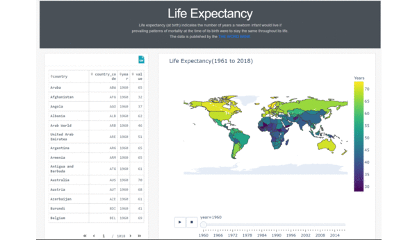

# Life Expectancy Dashboard
**[Mahshid AMIR MOAZAMI]**

*Paris Mai 2021*

## Description

Life expectancy is the key metric for assessing population health. Broader than the narrow metric of the infant and child mortality, which focus solely at mortality at a young age, life expectancy captures the mortality along the entire life course. It tells us the average age of death in a population.

The Dashboard built with Dash/Plotly, 100% Python. [Click here for a demo.](https://dash-lifeexpect.herokuapp.com/)

